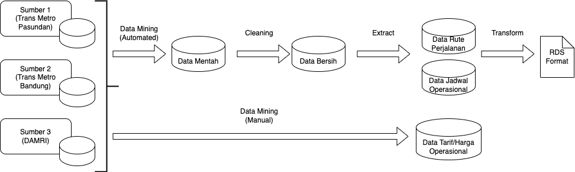
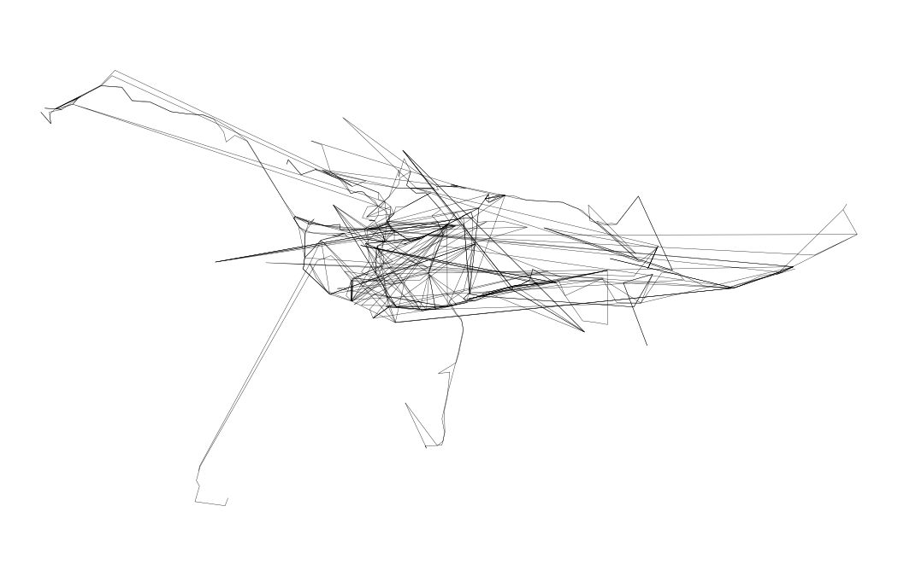

## GTFS Bandung

**Standardisasi Data Transportasi Umum di Kawasan Metropolitan Bandung menggunakan Teknik Big Data Processing untuk Integrasi Layanan Mobility as a Service**

Kawasan Metropolitan Bandung merupakan kota metropolitan terbesar di Jawa Barat yang memiliki tingkat mobilitas penduduk yang tinggi. Sarana transportasi umum yang disediakan oleh pemerintah tidak digunakan dengan maksimal oleh masyarakat karena kurangnya informasi terkait rute perjalanan dan koridor yang ada, serta tidak terintegrasi antar koridornya. Salah satu penyebabnya adalah data operasional angkutan umum belum memiliki standardisasi data antara masing-masing koridornya sehingga tidak dapat diintegrasikan untuk kepentingan konektivitas antar koridornya dan distribusi informasi terpusat. Dengan mengumpulkan data operasional angkutan umum dari Dinas Perhubungan Provinsi Jawa Barat dan aplikasi Moovit yang kemudian distandardisasi menggunakan teknik big data processing maka hasil data berstandar tersebut dapat dimanfaatkan untuk integrasi angkutan umum antar koridornya yang digunakan pada layanan Mobility as a Service sehingga masyarakat dapat menggunakan beberapa koridor dalam satu kali perjalanan untuk mencapai tempat yang dituju dengan informasi yang lengkap dan akurat dari hasil standardisasi.

Description about files in this repository:

-   **00_get.R** for getting Transjakarta routes and stops details
-   **00_schedule.R** for getting current schedules
-   **01\*.R** - **08\*.R** for creating GTFS formatted txt files
-   **data** directory for storing data
-   **figs** directory for images

### Workflow

### Data Sources

-   [Moovit](https://moovitapp.com/)
-   Dinas Perhubungan Provinsi Jawa Barat

### Bandung Route Service

### Contribution

This repository was a forked project from [Andi Herlan](https://github.com/akherlan/transjakartagtfs) then modified by 18220081 - Muhamad Fariz Ramadhan for Final Project / Thesis in Institut Teknologi Bandung